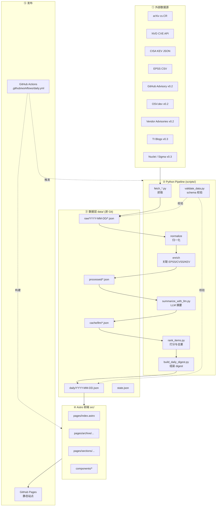
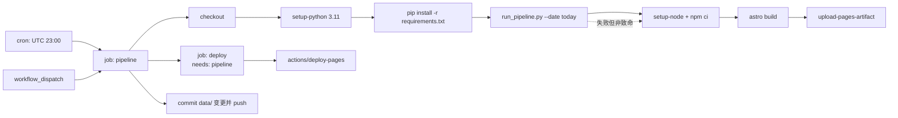
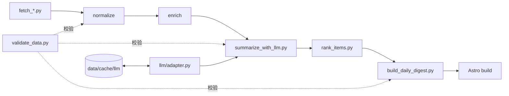

# Cyber Security Daily Radar — 架构文档 (ARCHITECTURE)

- 文档版本：v1.0
- 更新日期：2026-04-27
- 配套文档：[PRD.md](./PRD.md)

---

## 1. 总体架构

### 1.1 分层视图

本系统采用**静态数据管线 + 静态站点**的极简架构：所有"动态"都发生在 GitHub Actions runner 中，最终产物是一堆静态 JSON 与静态 HTML。



### 1.2 关键设计取舍

| 取舍 | 选择 | 原因 |
|---|---|---|
| 存储 | 文件 + Git，不用 DB | 历史可审计、零运维、可 fork |
| 前端 | Astro 静态生成 | 首屏快、SEO 好、部署简单 |
| 语言分工 | Python 做数据、TS 做前端 | 各自生态最强 |
| LLM | 默认 OpenAI Responses API + Adapter | 先跑通，后续可换 |
| 构建 | GitHub Actions | 零服务器 |

---

## 2. 数据流

### 2.1 端到端数据流

```
fetch raw data
     ↓  写入 data/raw/YYYY-MM-DD/<source>.json
normalize
     ↓  统一 raw_item schema，写入 data/processed/normalized.json
enrich
     ↓  关联 EPSS / KEV / CVSS，聚合 CVE 多源
     ↓  写入 data/processed/enriched.json
LLM summarize (带缓存)
     ↓  每条生成 llm_summary，结果写 data/cache/llm/{hash}.json
     ↓  合并回 data/processed/summarized.json
rank
     ↓  计算 rank_score，去重，分配 sections
     ↓  写入 data/processed/ranked.json
build daily digest
     ↓  选 Top N、裁剪字段，写入 data/daily/YYYY-MM-DD.json
static site build
     ↓  Astro 读取 data/daily/*.json 与 data/state.json
     ↓  构建 dist/，部署到 GitHub Pages
```

### 2.2 每个阶段的契约

- **每一步只读上一步的产物 + 只写自己负责的文件**，便于单步回放、单步调试。
- 每一步结束后调用 `validate_data.py` 按对应 schema 校验；校验不过则**管线失败**（而非静默继续）。
- 所有中间产物都落盘 JSON，**不存在"只在内存里"的状态**。

---

## 3. Python 脚本职责划分

目录：`scripts/`

| 脚本 | 输入 | 输出 | 职责 | 是否访问外网 |
|---|---|---|---|---|
| `fetch_arxiv.py` | 日期参数 | `data/raw/<date>/arxiv.json` | 抓取 arXiv cs.CR 当日新提交 | 是 |
| `fetch_nvd.py` | 日期参数 | `data/raw/<date>/nvd.json` | 增量拉取 NVD CVE | 是 |
| `fetch_cisa_kev.py` | — | `data/raw/<date>/kev.json` | 拉取全量 KEV、标记当日新增 | 是 |
| `fetch_epss.py` | — | `data/raw/<date>/epss.csv` | 下载当日 EPSS 分数快照 | 是 |
| `fetch_osv.py` (v0.2) | 日期参数 | `data/raw/<date>/osv.json` | OSV.dev 增量 | 是 |
| `fetch_github_advisory.py` (v0.2) | 日期参数 | `data/raw/<date>/ghsa.json` | GitHub Advisory GraphQL | 是 |
| `normalize.py` | `data/raw/<date>/*` | `data/processed/<date>/normalized.json` | 归一到 `raw_item` schema | 否 |
| `enrich.py` | normalized + kev + epss | `data/processed/<date>/enriched.json` | 关联元数据、合并 CVE 多源 | 否 |
| `summarize_with_llm.py` | enriched + cache | `data/processed/<date>/summarized.json` + `data/cache/llm/*` | LLM 摘要 + 缓存命中 | 是（可 mock） |
| `rank_items.py` | summarized | `data/processed/<date>/ranked.json` | 打分、去重、分配 sections | 否 |
| `build_daily_digest.py` | ranked | `data/daily/<date>.json` | 裁剪为展示字段 | 否 |
| `validate_data.py` | 任意 JSON + schema 名 | 退出码 | 统一 schema 校验入口 | 否 |
| `run_pipeline.py` | 日期参数 | — | 串联上述步骤的本地/CI 编排入口 | 取决于子步 |

### 3.1 约定

- 每个脚本必须：
  - 支持 `--date YYYY-MM-DD`（默认今天，UTC）
  - 支持 `--dry-run`（只打印不写）
  - 输出结构化日志（JSON line 到 stderr）
- 不硬编码 token/endpoint；统一从 `scripts/config.py`（读 env）获取。
- fetcher 捕获网络错误并退出码 0（失败写 `errors.json`），**不拖垮整体**。
- 处理层（normalize/enrich/rank）遇到 schema 不合法必须**硬失败**。

---

## 4. Astro 前端职责划分

目录：`src/`

```
src/
  pages/
    index.astro               # 首页 = 最新一天的 digest
    archive/
      index.astro             # 按日期的归档列表
      [date].astro            # 指定日期的快照
    sections/
      [section].astro         # 某栏目的当日完整列表（例如 /sections/kev）
    about.astro               # 产品说明、安全边界、数据源
  layouts/
    BaseLayout.astro          # 头尾、暗色模式、meta
    SectionLayout.astro       # 栏目容器
  components/
    ItemCard.astro            # 条目卡片（通用）
    KevBadge.astro
    EpssBar.astro
    SeverityTag.astro
    SourceIcon.astro
    SummaryBlock.astro        # LLM 摘要渲染，含 refusal 占位
  content/
    config.ts                 # （可选）Content Collections 的 schema
  lib/
    data.ts                   # 读取 data/daily/*.json 的工具
    format.ts                 # 日期/分数格式化
  styles/
    global.css
```

### 4.1 约定

- 前端**只读 `data/daily/*.json` 和 `data/state.json`**，不直接读 raw/processed。
- 所有与"安全边界"相关的渲染（例如 `refusal=true` 的条目）集中在 `SummaryBlock.astro`，防止漏展示安全占位。
- 不做任何客户端数据请求；所有内容 build-time 注入。
- 日期、分数等展示逻辑放 `lib/`，不散落在页面里。

---

## 5. `data/` 目录设计

```
data/
  raw/
    2026-04-27/
      arxiv.json
      nvd.json
      kev.json
      epss.csv
      errors.json              # 当日抓取的失败记录（可选）
  processed/
    2026-04-27/
      normalized.json
      enriched.json
      summarized.json
      ranked.json
  cache/
    llm/
      <content_hash>.json      # LLM 响应缓存，key = raw_item.id + content_hash
  daily/
    2026-04-27.json            # 对外契约：前端唯一数据入口
    index.json                 # 所有可用日期的索引，供归档页使用
  state.json                   # 管线最近一次运行状态：时间、成功源、失败源
```

### 5.1 约定

- `raw/` 和 `daily/` **一定进 Git**，可复现、可回滚。
- `processed/` 进 Git 方便 debug；若体量过大（> 50MB/天）再考虑排除并由 Actions 产物承载。
- `cache/llm/` 进 Git（体量小、可避免重复计费）。若含敏感原文，再考虑改造。
- 文件名一律使用 UTC 日期 `YYYY-MM-DD`。

---

## 6. `schemas/` 目录设计

```
schemas/
  raw_item.schema.json         # 第 2 步 normalize 后的统一契约
  llm_summary.schema.json      # LLM 必须返回的结构
  digest_item.schema.json      # 前端消费的最终结构
  daily_digest.schema.json     # data/daily/<date>.json 的包装结构
  state.schema.json            # data/state.json
```

### 6.1 约定

- 全部使用 **JSON Schema draft 2020-12**。
- Python 端用 `jsonschema` + Pydantic 两道防线：Pydantic 做类型与枚举、`jsonschema` 做正式合规。
- 前端若使用 Content Collections，通过 `zod` 同步定义（允许少量冗余，手工同步即可，MVP 不做自动生成）。
- **任何 schema 变更必须配套升 `data/daily/*.json` 的 `schema_version`**，前端根据 version 渲染或降级。

### 6.2 Exploit / PoC 相关的数据契约边界

`RiskSignal` 允许出现以下 **存在性与链接** 字段，fetcher 归一化时按需填写；但同一对象中**禁止**出现任何包含 PoC 正文、payload、shellcode、攻击步骤的字段：

| 字段 | 允许 | 说明 |
|---|---|---|
| `has_public_exploit: bool` | ✅ | 是否已有公开 exploit / PoC |
| `exploit_maturity: enum` | ✅ | `unreported` / `poc` / `functional` / `weaponized` / `in_the_wild`，对齐 CVSS Temporal E |
| `exploit_references: ExploitRef[]` | ✅ | 每项仅 `{url, source, label?}`，只存 URL + 元数据 |
| `raw_exploit_text` / `payload` / `poc_code` / `attack_steps` | ❌ | schema 层不定义该类字段；`additionalProperties: false` 会直接拦截任何试图写入的 fetcher |

前端渲染约束：仅展示徽章（如 "⚠ 已有公开 PoC"、"⚠ 在野利用"）和外链列表（`target="_blank" rel="nofollow"`），不以任何方式抓取或镜像第三方页面正文。

---

## 7. GitHub Actions 自动化流程

目录：`.github/workflows/`

### 7.1 `daily.yml`：每日全流程



要点：
- `secrets.OPENAI_API_KEY` 通过 `env:` 传给 python 步骤。
- pipeline 结束后将 `data/` 目录的新增文件**提交回仓库**（使用 `peter-evans/create-pull-request` 或直接 `git push` 到 main，视项目安全策略二选一）。
- `astro build` 读的是提交回来的最新 `data/daily/`。
- 任一步非致命错误写入 `errors.json`，`deploy` job 仍可执行。
- 致命错误（schema 不合法）走 fail-fast，阻止发布。

### 7.2 `deploy.yml`：仅前端构建

- 手动触发，用于前端改动不需要重新抓数据时。
- 步骤：checkout → setup-node → npm ci → astro build → deploy-pages。

### 7.3 权限

- workflow 使用 `permissions: contents: write, pages: write, id-token: write`（Pages 官方部署要求）。
- 其它 job 默认只读。

---

## 8. 本地开发流程

### 8.1 一次性准备

```
# 1. Python
python3.11 -m venv .venv
source .venv/bin/activate
pip install -r requirements.txt

# 2. Node
cd src && npm ci && cd ..

# 3. 环境变量（从 .env.example 复制）
cp .env.example .env
#   LLM_MOCK=1          # 开发期默认 mock，不烧钱
#   OPENAI_API_KEY=...  # 仅在需要真跑 LLM 时填
```

### 8.2 常用命令

```
# 只跑抓取
python scripts/run_pipeline.py --date 2026-04-27 --only fetch

# 只跑 LLM（默认 mock）
python scripts/run_pipeline.py --date 2026-04-27 --only summarize

# 一键跑完（使用 mock）
LLM_MOCK=1 python scripts/run_pipeline.py --date 2026-04-27

# 仅校验
python scripts/validate_data.py --schema digest_item --file data/daily/2026-04-27.json

# 本地预览站点
cd src && npm run dev
```

### 8.3 约定

- `.env` 永远不进 Git；`.env.example` 进 Git 并列出全部变量名（不含值）。
- 本地默认 `LLM_MOCK=1`，显式 `LLM_MOCK=0` 才会真实调用。
- 本地回灌历史：`--date 2026-04-20 --date 2026-04-21 ...` 循环跑。

---

## 9. 错误处理策略

| 层级 | 错误类型 | 策略 |
|---|---|---|
| fetcher | 网络超时 / 429 | 指数退避重试 ≤ 3 次；仍失败则写 `errors.json`，跳过该源 |
| fetcher | 源 schema 变更 | 当作抓取失败；**不**尝试猜测字段 |
| normalize | 单条字段缺失 | 该条丢弃，计数上报，不中断整体 |
| normalize | 全量失败率 > 20% | 硬失败，pipeline 退出非 0 |
| LLM | 超时 / 限流 | 退避重试 ≤ 2 次；仍失败则 `llm = null`，rank 时降权 |
| LLM | 返回 JSON 不合规 | 最多 2 次重试（带"请修正格式"提示），再失败标记 `refusal=true` + `refusal_reason="invalid_json"` |
| rank | 分母为 0 / 配置错 | 硬失败 |
| build_digest | schema 不合法 | 硬失败 |
| astro | 数据缺失 | 渲染 banner「今日更新失败，展示昨日内容」 |
| deploy | Pages 接口抖动 | Actions 默认重试；手动触发 `deploy.yml` 兜底 |

全局原则：
- **数据源失败是常态**，要 graceful。
- **数据契约失败是异常**，要 fail-fast。
- 所有错误结构化写 `data/raw/<date>/errors.json`，并在 `state.json` 汇总。

---

## 10. LLM API Mock 模式

### 10.1 开关

- 环境变量 `LLM_MOCK`：
  - `LLM_MOCK=1`（默认本地开发）→ 走 mock，不发任何请求。
  - `LLM_MOCK=0` → 走真实 API。
- CI 中 `LLM_MOCK=0`；本地开发建议 `LLM_MOCK=1`。

### 10.2 Mock 行为

- Mock 根据 `raw_item` 的 `title + raw_text[:200]` 生成**确定性**输出：
  - `summary_zh` = `f"[MOCK] {title[:80]}"`
  - `why_it_matters_zh` = 固定文案 + 源名
  - `tags` = 基于关键词的简单规则（含 "RCE"→`rce`，含 "bypass"→`auth-bypass` 等）
  - `severity_hint` = 根据 CVSS/EPSS 简单映射
  - 各 `*_score` = 由 hash 映射到 [0.2, 0.9]
  - `refusal` = 标题或 raw_text 命中"exploit code/payload/poc"时为 true
- 同一输入必然同一输出，便于前端快照测试。
- Mock 输出**必须走同一份 schema 校验**，保证与真实 API 结构一致。

### 10.3 LLM Adapter

- `scripts/llm/adapter.py` 暴露 `def summarize(raw_item) -> dict`；内部按 `LLM_PROVIDER` 分派：
  - `openai`（默认）
  - `mock`
  - 预留 `anthropic` / `local`（v0.3）
- 调用前查 `data/cache/llm/<hash>.json`，命中即返回缓存，**不**计费。

---

## 11. 避免 API Key 泄露的做法

1. **不写在代码里**：所有 Key 从 `os.environ` 读取；`config.py` 集中封装，找不到就报错并停止。
2. **`.env` 只在本地**：加入 `.gitignore`，提供 `.env.example` 作为说明。
3. **CI 用 Secrets**：`OPENAI_API_KEY` 通过 GitHub Actions Secrets 注入，仅在 `daily.yml` 的 summarize 步骤可见。
4. **日志脱敏**：统一日志函数禁止打印以 `sk-` / `ghp_` / `Bearer ` 开头的内容；出错时只打印 key 的前 4 后 4 位。
5. **数据脱敏**：任何落盘 JSON（包括 `cache/llm/*`）严禁包含请求头或 Key 字段；缓存 key 使用 hash，而非包含任何凭据。
6. **PR 审查**：在仓库根添加 `.gitleaks` 或 GitHub 的 "secret scanning" 工作流（v0.2 加）。
7. **最小权限**：只赋予 LLM 必要的 scope；GitHub Actions `GITHUB_TOKEN` 最小化 `permissions`。
8. **定期轮换**：文档化每季度轮换 Key；轮换流程记录在 README。

---

## 12. 幂等性：避免每日重复数据

这是静态管线最重要的工程要求之一。核心思路：**一切都以 `id` 为主键 + 落盘去重 + 缓存命中**。

### 12.1 统一 ID 规则

- `raw_item.id = "{source}:{native_id}"`
  - 例：`nvd:CVE-2026-1234`、`arxiv:2604.01234`、`kev:CVE-2026-1234`、`ghsa:GHSA-xxxx-xxxx-xxxx`
- **同一条目无论抓取多少次，id 永远相同**。

### 12.2 抓取侧幂等

- 每天的抓取结果写入 `data/raw/YYYY-MM-DD/<source>.json`，日期本身作为分片。
- 如果同一天多次运行，**覆盖**当天文件（以最后一次为准），但**不会**污染其它日期。
- fetcher 支持"增量游标"：保存上次抓取时间到 `data/state.json`，下次抓取只拉新的；失败时游标不前进。

### 12.3 跨日去重

- `enrich.py` 维护 `data/processed/seen_ids.json`（或合并进 `state.json`）：
  - 某条 `id` 若已在过去 N 天（默认 14 天）的 daily digest 中出现过，今日**仅在有重大变更时**（如 EPSS 显著跃升、CVSS 升级、新进 KEV）重新上榜，否则不再进 Top 栏目。
- 判断"重大变更"的 key：`(id, cvss.score, epss.score, kev.date_added, updated_at)` 构成指纹，指纹变了才重新进榜。

### 12.4 LLM 缓存幂等

- cache key = `sha256(id + "||" + canonical(title) + "||" + canonical(raw_text))`。
- 文案没变就**不重复调用 LLM**，严格幂等 + 省钱。
- Mock 模式也遵循缓存逻辑，产出完全可重复的结果，方便快照测试。

### 12.5 输出侧幂等

- `build_daily_digest.py` 写 `data/daily/YYYY-MM-DD.json`：同一天重复运行 = 覆盖同一文件。
- 文件内按 `id` 排序输出，避免因顺序差异造成 Git 噪声 diff。
- `daily/index.json` 在写入前去重并排序。

### 12.6 站点侧幂等

- Astro 在 build 时基于 `daily/*.json` 生成页面；同一份输入 → 同一份输出。
- GitHub Pages 部署使用 artifact 覆盖，不会出现"老页面残留"问题。

---

## 附录 A：模块依赖（简化）



---

## 附录 B：环境变量清单

| 变量 | 必填 | 默认 | 说明 |
|---|---|---|---|
| `LLM_PROVIDER` | 否 | `openai` | `openai` / `mock` / 其它 |
| `LLM_MOCK` | 否 | `1`（本地） / `0`（CI） | 等价于 `LLM_PROVIDER=mock` |
| `OPENAI_API_KEY` | 生产必填 | — | 生产模式调用 |
| `OPENAI_MODEL` | 否 | `gpt-4o-mini` | 可通过 env 覆盖 |
| `GITHUB_TOKEN` | 否 | Actions 注入 | 仅 GHSA fetcher 需要 |
| `NVD_API_KEY` | 否 | — | 有则提升限速 |
| `DATA_RETENTION_DAYS` | 否 | `365` | 归档页保留天数 |
| `DUP_WINDOW_DAYS` | 否 | `14` | 跨日去重窗口 |

---

（文档完）
